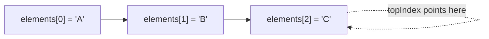
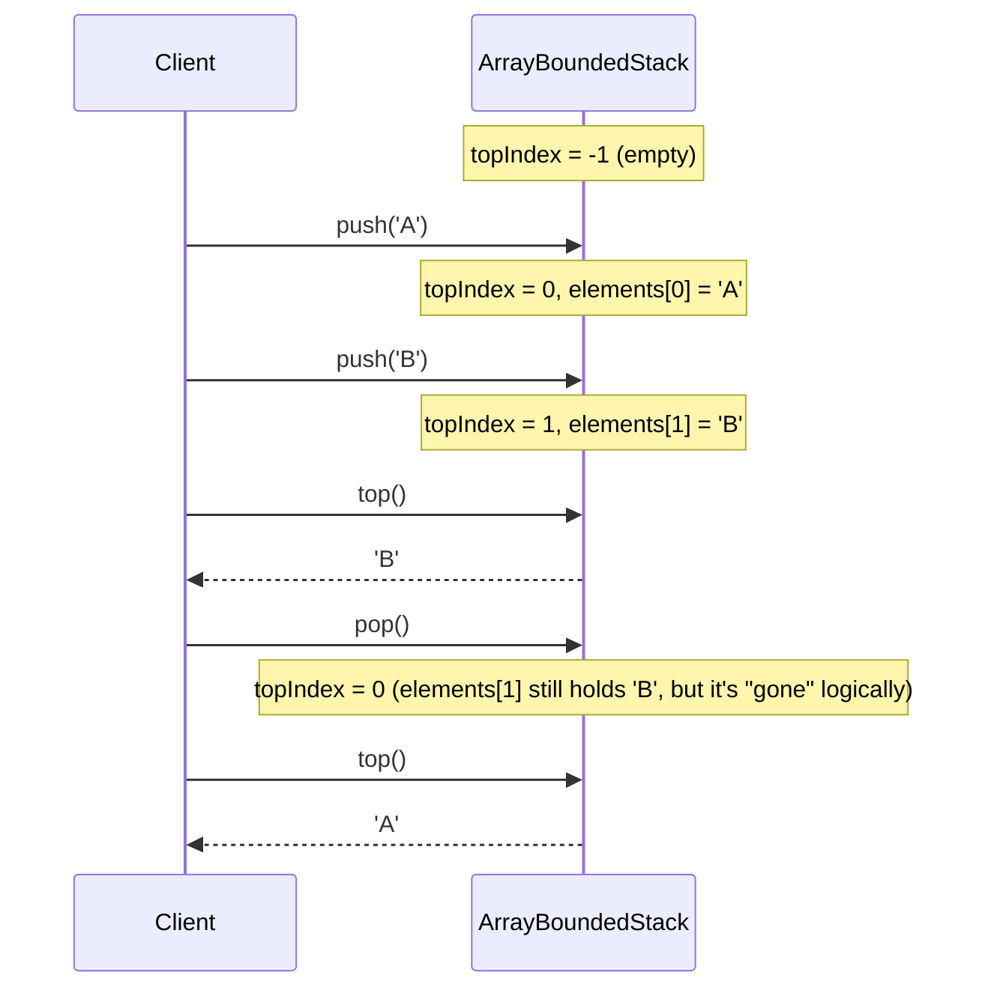
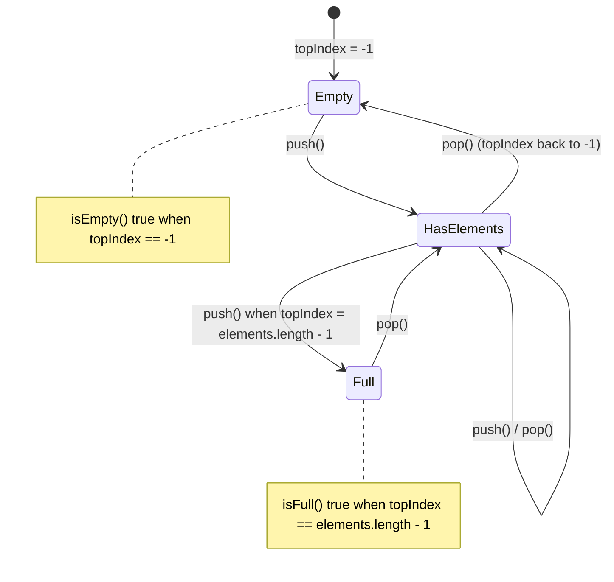
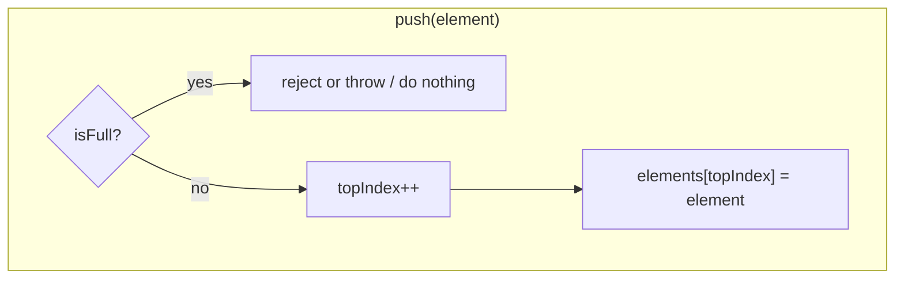
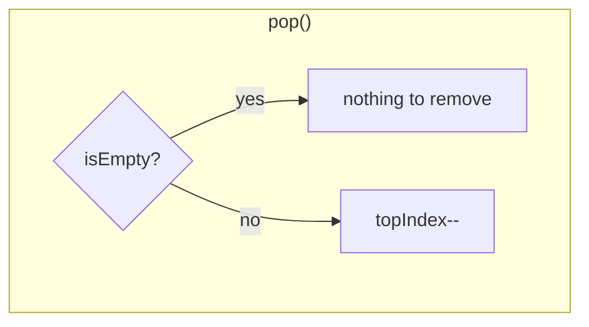
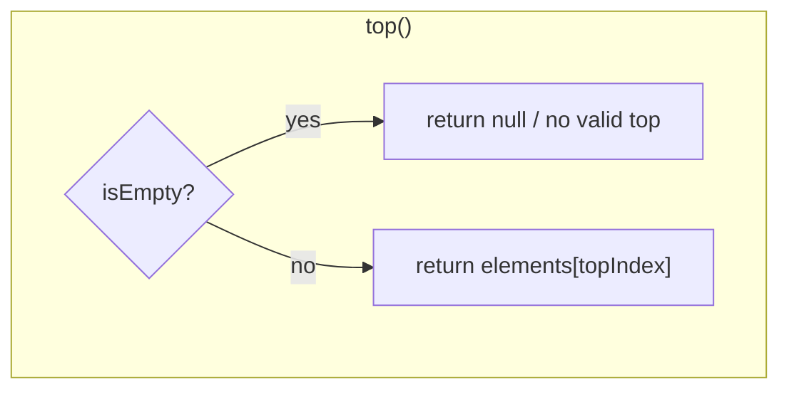

# Visualizing `ArrayBoundedStack`

Open this file with **Ctrl+Shift+V** (Markdown: Open Preview). VS Code's built-in
preview renders Mermaid diagrams natively.

## 1. What the array + `topIndex` actually look like

A stack backed by an array only needs one piece of state: `topIndex`, the index
of the most recently pushed element. Everything (`isEmpty`, `isFull`, `push`,
`pop`, `top`) is answered by comparing `topIndex` to the array bounds.

| index      | 0   | 1   | 2   | 3     | ... | N-1   |
|------------|-----|-----|-----|-------|-----|-------|
| `elements` | 'A' | 'B' | 'C' | empty | ... | empty |
|            |     |     | ^ `topIndex` |     |       |

After pushing `'A'`, `'B'`, `'C'` (in that order) onto a stack of capacity `N`,
`topIndex == 2` it points at `'C'`, the last thing pushed.

## 2. Push / Pop as index movement

**Key insight:** `pop()` doesn't need to erase the value, decrementing
`topIndex` is enough to logically remove it. The next `push` will just
overwrite that slot.

## 3. `isEmpty` / `isFull` as boundary conditions

## 4. Decision logic for each method

## 5. Questions to check your understanding

1. What is `topIndex` when the stack is brand new?
2. If `elements.length == 5`, what value of `topIndex` means the stack is full?
3. Why can `pop()` be implemented as "just move the index" instead of clearing
   the array slot?
4. What should `isEmpty()` return right after construction, and right after a
   single `push` followed by a single `pop`?
